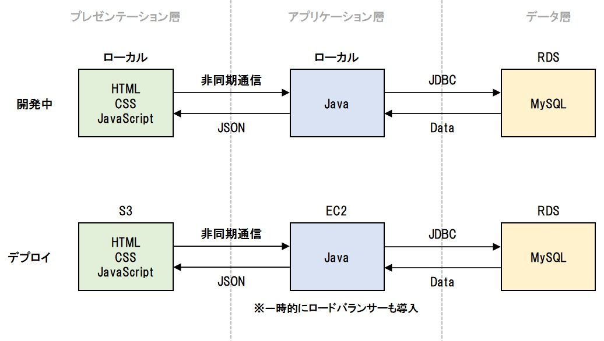

# AWSエクササイズ

## 演習の全体像

Web3層アーキテクチャ（3Tier）でナレッジシステムを開発する。ローカル（データ層はクラウド）上で開発をし、全体的に完成したら順次クラウドにデプロイする。



<br><br>

ナレッジシステムは、以下の機能を実装する。

- ナレッジ一覧機能（初期表示）
- ナレッジ追加機能
- ナレッジ削除機能


<br><br>

## プロジェクト構成

### プレゼンテーション層

ローカル上に下記の構成でファイルを作成する。


<br>

### アプリケーション層

Eclipse上にknowledge-apiプロジェクトを用意し、以下の構成でファイルを作成する。


<br>

### データ層

開発段階からRDS上にMySQLを用意し、アプリケーション層と接続する。

<br><br>

## テーブル定義

**KNOWLEDGEテーブル**

| 論理名 | 物理名 | データ型 | PK | UK | FK | Not Null | Default |
|:-:|:-:|:-:|:-:|:-:|:-:|:-:|:-:|
| ID | ID | INT(11) | ◯ |  |  |  | 自動採番 |
| CATEGORY | カテゴリー | VARCHAR(30) |  |  |  | ◯ |  |
| KNOWLEDGE | ナレッジ | TEXT |  |  |  | ◯ |  |
| UPDATE_AT | 更新日 | TIMESTAMP |  |  |  | ◯ | 現在日時 |

```sql
CREATE DATABASE IF NOT EXISTS knowledge;

USE knowledge

CREATE TABLE IF NOT EXISTS KNOWLEDGE (
   ID INT(11) AUTO_INCREMENT PRIMARY KEY
  ,CATEGORY VARCHAR(30) NOT NULL
  ,KNOWLEDGE TEXT NOT NULL
  ,UPDATE_AT TIMESTAMP DEFAULT CURRENT_TIMESTAMP NOT NULL
);

INSERT INTO KNOWLEDGE (CATEGORY, KNOWLEDGE) VALUES ('Java', 'Javaは言語として高性能で、OSに依存せずに動作すること、開発効率と保守性が高いこと、ライブラリが充実していることなどのメリットがあります。');
INSERT INTO KNOWLEDGE (CATEGORY, KNOWLEDGE) VALUES ('Java', 'Javaのバージョンは半年に1度、3月と9月にリリースされ、3年に1度、長期サポート（LTS）版がリリースされます。');
INSERT INTO KNOWLEDGE (CATEGORY, KNOWLEDGE) VALUES ('AWS', 'AWS（Amazon Web Services）は、Amazon社が提供するクラウドサービスプラットフォームで、2021年9月時点で220を超えるサービスを提供しています。');
```

<br>

### RDSの設定

- MySQL WorkbenchでRDSに接続する。
    - ユーザ名：root
    - パスワード：P4ssw0rd
    - スキーマ：knowledge
- KNOWLEDGEテーブルの作成とデータの用意をする。（各ルームの代表者）

<br><br>

## 機能仕様

### 1. ナレッジ一覧機能

#### 処理仕様


| ファイル名 | 処理内容 |
|:---:|-----|
| knowledge.html | ロード時に非同期通信でListKnowledgeServletにGET通信し、ナレッジデータを全件取得する。 |
| FindKnowledgeServlet.java | URLパターン：/find<br>KnowledgeDaoのfindAll()メソッドを呼び出し、ナレッジデータを全件取得する。取得したナレッジデータをJSON形式に変換し、レスポンスのボディ部に書き出す。 |
| KnowledgeDao.java | メソッド名：findAll()<br>KNOWLEDGEテーブルのデータを全件取得する。取得したデータをListに格納し、返却する。 |

<br>

### 2. ナレッジ登録機能

#### 処理仕様


| ファイル名 | 処理内容 |
|:---:|-----|
| knowledge.html | 追加ボタン押下時に非同期通信でCreateKnowledgeServletにPOST通信し、ナレッジデータを登録する。POST通信時、入力されたカテゴリー、ナレッジをJSON形式で送る。<br>登録処理後、ナレッジを再度全件検索し、カテゴリーとナレッジの入力値をクリアする。 |
| CreateKnowledgeServlet.java | URLパターン：/create<br>KnowledgeDaoのcreate()メソッドを呼び出し、リクエスト情報（カテゴリー、ナレッジ）を基にナレッジデータを登録する。 |
| KnowledgeDao.java | メソッド名：create()<br>KNOWLEDGEテーブルにデータを登録する。 |

<br>

### 3. ナレッジ削除機能

#### 処理仕様


| ファイル名 | 処理内容 |
|:---:|-----|
| knowledge.html | 削除ボタン押下時に非同期通信でDeleteKnowledgeServletにPOST通信し、ナレッジデータを削除する。POST通信時、削除対象ナレッジのIDをJSON形式で送る。<br>削除処理後、ナレッジを再度全件検索する。 |
| DeleteKnowledgeServlet.java | URLパターン：/delete<br>KnowledgeDaoのdelete()メソッドを呼び出し、対象のナレッジデータを削除する。 |
| KnowledgeDao.java | メソッド名：delete()<br>KNOWLEDGEテーブルから対象データを削除する。 |

<br><br>

## 演習手順

### 1. ナレッジシステムの開発

- 機能仕様を基にナレッジシステムを開発する。
    - ナレッジ一覧機能
    - ナレッジ追加機能
    - ナレッジ削除機能

<br>

### 2. アプリケーション層のデプロイ

- 以下の仕様でEC2インスタンスを起動する。
    - タグ：自分の番号_knowledge_api_1
    - AMI：Ubuntu Server 22.04 LTS
    - インスタンスタイプ：t2.micro
    - キーペア：新規作成する
        - キーペア名：自分の番号_knowledge_key
        - タイプ：ED25519
        - 形式：.pem
    - VPC：デフォルト
    - サブネット：ap-northeast-1a
    - セキュリティグループ：新規作成する
        - セキュリティグループ名：自分の番号_knowledge_security
        - ssh(22)：0.0.0.0/0、http(80)：0.0.0.0/0、tcp(8080)：0.0.0.0/0
    - ストレージ：10GiB
- アプリケーション層（Servlet）のwarファイルを生成する。
- インスタンスに接続し、以下のソフトウェアをインストールし、適切な設定でwarファイルをデプロイ、公開する。
    - openjdk-11-jre
    - tomcat9
    - apache2
- HTTPクライアントツール（Talend API Tester）で公開したアプリケーション層に対してデータを送信し、想定通りにデータの取得や登録ができることを確認する。
    - `http://[パブリックIPアドレス]/knowledge-api/find`
    - `http://[パブリックIPアドレス]/knowledge-api/create`
    - `http://[パブリックIPアドレス]/knowledge-api/delete`
- 構築したEC2インスタンスのイメージ（AMI）を作成する。
    - イメージ名：自分の番号_knowledge_api_image
    - イメージの説明：任意の説明文
    - ボリュームサイズ：10

<br>

### 3. プレゼンテーション層のデプロイ

- 以下の仕様でknowledge.htmlをS3にホスティングする。
    - バケット名：自分の番号-knowledge
- CloudFrontを作成し、S3と連携する。
- エンドポイントにアクセスし、ナレッジシステムが正常に動作することを確認する。
    - ナレッジ一覧機能
    - ナレッジ登録機能
    - ナレッジ削除機能

<br>

### 4. ロードバランサーの導入

<span style="color:red;">※作成数に上限があるため、動作確認後は上記3.までの状態に戻す。</span>

- 2.で作成したAMIを基にEC2インスタンスを作成する。
    - タグ：自分の番号_knowledge_api_2
    - AMI：自作のAMI
    - インスタンスタイプ：t2.micro
    - キーペア：自分の番号_knowledge_key
    - VPC：デフォルト
    - サブネット：ap-northeast-1c
    - セキュリティグループ：自分の番号_knowledge_security
    - ストレージ：10GiB
- ロードバランサーを作成する。
    - Load balancer name：自分の番号_elb_knowledge
    - Mappings：ap-northeast-1a、ap-northeast-1c
    - Security Groups：新規作成する
        - セキュリティグループ名：自分の番号_knowledge_security_elb
        - http(80)：0.0.0.0/0
    - Target group：新規作成する
        - Target group name：999-knowledge-target-group
        - Targets：自分の番号_knowledge_api_1、自分の番号_knowledge_api_2
- 2つのEC2インスタンスのアクセス制御を施す。
    - ロードバランサーからのみアクセスできるようにする。
    - HTTPクライアントツール（Talend API Tester）で、各EC2インスタンスに直接アクセスできないことを確認する。
- index.htmlを修正する。
    - ロードバランサー経由でアプリケーション層にアクセスする。
    - 正常にナレッジシステムが動作することを確認する。
